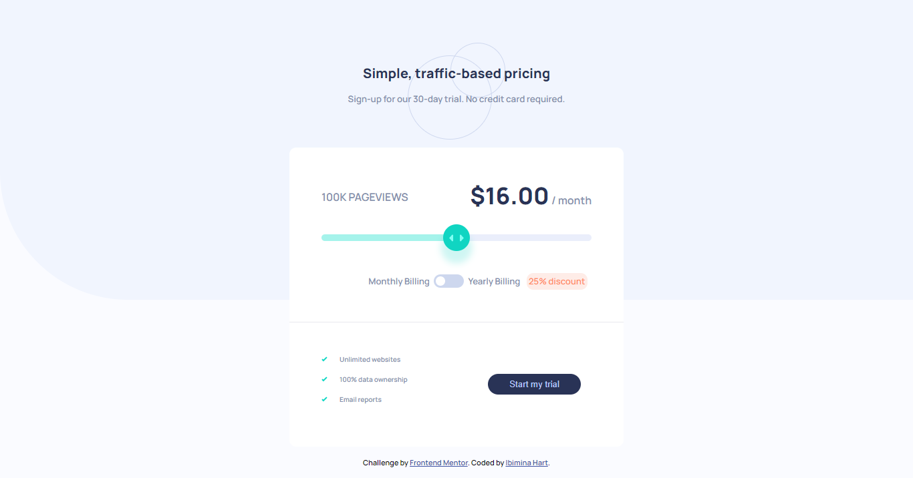
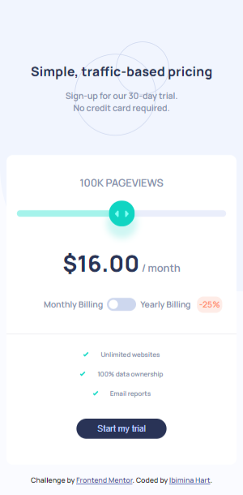

# Frontend Mentor - Interactive pricing component solution

This is a solution to the [Interactive pricing component challenge on Frontend Mentor](https://www.frontendmentor.io/challenges/interactive-pricing-component-t0m8PIyY8). Frontend Mentor challenges help you improve your coding skills by building realistic projects. 

## Table of contents

- [Overview](#overview)
  - [The challenge](#the-challenge)
  - [Screenshot](#screenshot)
  - [Links](#links)
- [My process](#my-process)
  - [Built with](#built-with)
  - [What I learned](#what-i-learned)
  - [Continued development](#continued-development)
  - [Useful resources](#useful-resources)
- [Author](#author)


## Overview

### The challenge

Users should be able to:

- View the optimal layout for the app depending on their device's screen size
- See hover states for all interactive elements on the page
- Use the slider and toggle to see prices for different page view numbers


Here are the different page view ranges and the corresponding monthly price totals:

- 10K pageviews / $8 per month
- 50K pageviews / $12 per month
- 100K pageviews / $16 per month
- 500k pageviews / $24 per month
- 1M pageviews / $36 per month

If the visitor switches the toggle to yearly billing, a 25% discount should be applied to all prices.


### Screenshot





### Links

- Solution URL: (https://github.com/ibimina/interactive-pricing-component-main)
- Live Site URL:(https://ibimina.github.io/interactive-pricing-component-main/)

## My process

### Built with

- Semantic HTML5 markup
- CSS custom properties
- Flexbox
- Mobile-first workflow


### What I learned


### Input[type="range"] runnable track Design

I learnt how to redesign an input type= range.
This css snippet sets te input to awidth of 100% and height of 10px. The background color changes from left to right.Javascript code is used increase or decrease the color as the input thumb is change

```css
input[type="range"] {
  width: 100%;
  -webkit-appearance: none;
  height: 10px;
  background: linear-gradient(
    to right,
    hsl(174, 77%, 80%) 0%,
    hsl(174, 77%, 80%) 50%,
    hsl(224, 65%, 95%) 0%,
    hsl(224, 65%, 95%) 100%
  );
  border-radius: 5px;
  margin-bottom: 3rem;
}
```
- Input[type="range"] Thumb Design
THis csssnippet code is used to design the thumb 
```css
input[type="range"]::-webkit-slider-thumb {
  -webkit-appearance: none;
  width: 40px;
  height: 40px;
  border-radius: 50%;
  background-image: url(images/icon-slider.svg);
  background-color: hsl(174, 86%, 45%);
  background-repeat: no-repeat;
  background-position: center;
  box-shadow: 0px 15px 10px 4px rgba(16, 212, 194, 0.2);
}
```
- This Html snippet is used to create a toggle to switch from monthly price to yearly price

```html
<label class="toggle">
              <input type="checkbox" id="bill-type" name="bill-type" value="check"/>
              <span class="toggle-thumb"></span>
            </label>
```
- This css snippet is used to style the toggle and translate it from left to right
```css
.toggle {
  display: inline-block;
  position: relative;
  width: 45px;
  height: 20px;
  margin-right: .4rem;
}
.toggle input {
  opacity: 0;
  width: 0;
  height: 0;
}
.toggle-thumb {
  position: absolute;
  top: 0;
  bottom: 0;
  left: 0;
  right: 0;
  border-radius: 25px;
  transition: .4s;
  -webkit-transition: .4s;
   background-color: hsl(223, 50%, 87%);
}

.toggle-thumb:before {
  content: "";
  position: absolute;
  background-color: white;
  width: 14px;
  height: 14px;
  border-radius: 50%;
  left: 3px;
  top: 3px;
  transition: .4s;
  -webkit-transition: .4s;
}
.toggle input:checked + .toggle-thumb{
  background-color: aqua;
}
input:checked +.toggle-thumb:before {
  transform: translateX(26px);
 -webkit-transform:  translateX(26px);
  -ms-transform:  translateX(26px);
}
```
##  Javascript to change textcontent,background,
- javascript snippet to control the background color of the input runnable track as the input thumb is changed
- select the input element,store the value in a variable 
- mutiply the value by 25(because our max value is an index of 4 and a counting number of 5 from 0. 100/5 = 25)
- input the value gotten in the linear gradient
```js
 const view = rangeSlider.value;
  let amount;

  let val = view * 25;

  rangeSlider.style.background = `linear-gradient(  to right,
  hsl(174,77%,80%)0% ,
    hsl(174, 77%, 80%) ${val}%,
    hsl(224, 65%, 95%) 0%,
    hsl(224, 65%, 95%) 100%
  )`;

```
- Using coditional statement to change the price per month or per year 

- select the input range,toggle,and text to be changed
- make a function that calculate the yearly discount 

```js
function cal(amount) {
  let monthPrice = (amount * 12 * 0.75).toFixed(2);
  return monthPrice;
}
```
-  make a function that checks the following conditional statement:
- store the input value in a variable and check if its equal to 0,1,2,3,4 and if the month/yearly is true

```js
if (view === "0" && !thumbSlider.checked) {
    views.textContent = `10K`;
    price.textContent = "$8.00";
    year.textContent = "/ month";
  }
```
- if true change the content else  call the function that calculates the per year price and change to yearly content
```js
else if (view === "0" && thumbSlider.checked) {
    views.textContent = `10K`;
    amount = 8;
    price.textContent = `$${cal(amount)}`;
    year.textContent = "/year";
  }
```
- add eventlistener to the input with a change or input event and call the fuction
```js
rangeSlider.addEventListener("input", slide);
```

### Useful resources

- [Resource 1](https://www.developer.mozilla.org/en-US/docs/Web/HTML/Element/input/checkbox) - This helped me in using the checked attribute for the toggle slide to know if the it is checked on not reason. I really liked this pattern and will use it going forward.
- [Resource 2](https://www.developer.mozilla.org/en-US/docs/Web/HTML/Element/input/range) - This is an amazing article which helped me finally understand input range tag. I'd recommend it to anyone still learning this concept.


## Author

- Ibimina Hart
- Frontend Mentor -(https://www.frontendmentor.io/profile/ibimina)
- Twitter - (https://www.twitter.com/ibiminaaH)


